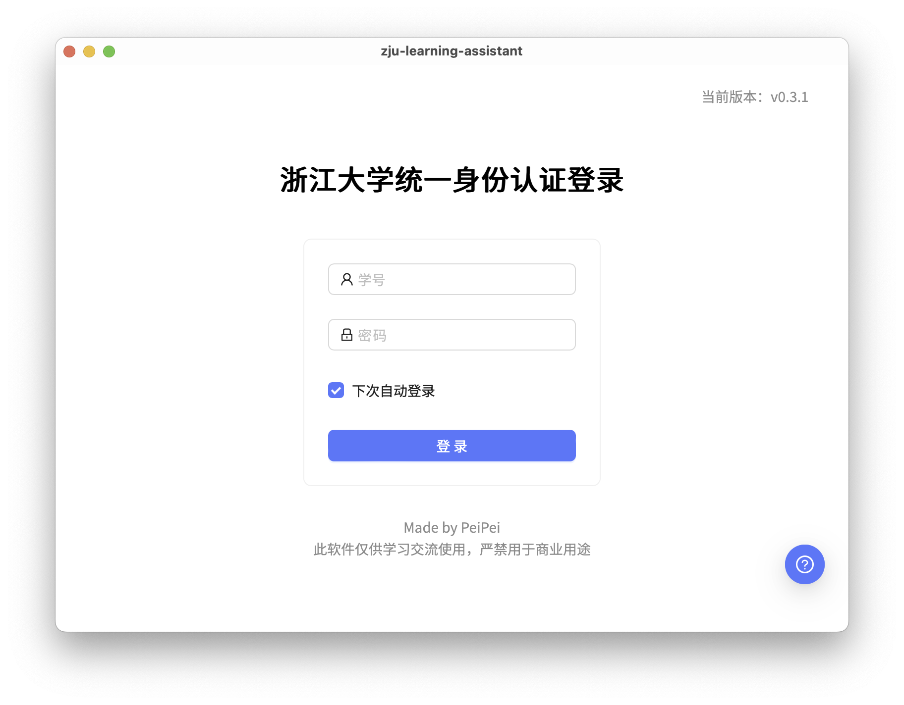
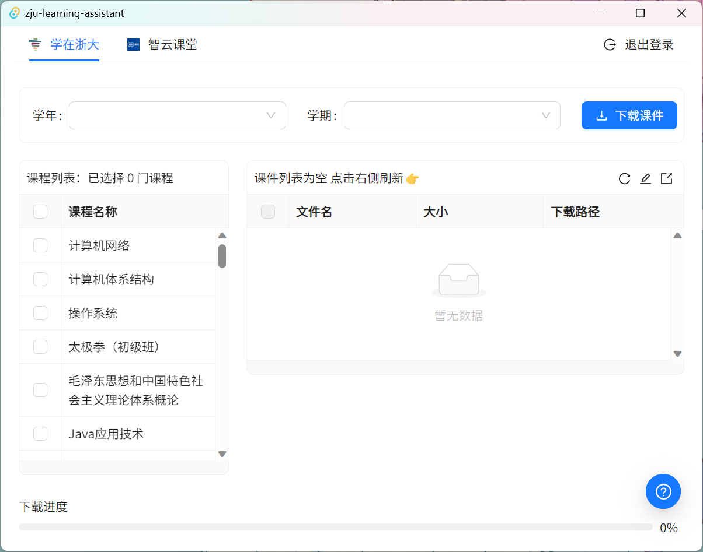
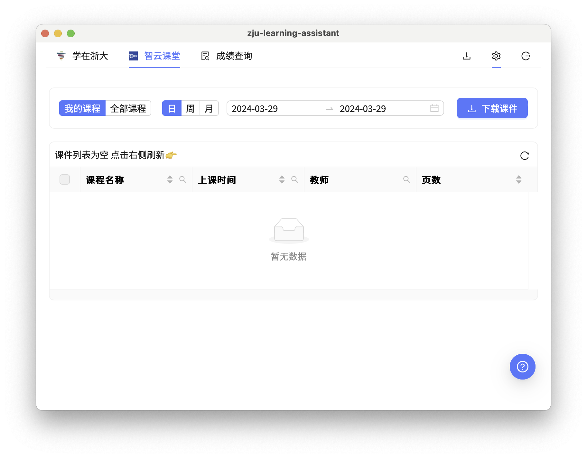

<h1 align="center">
  
   
  ZLA: ZJU Learning Assistant
   
</h1>

<h3 align="center">
帮你快速下载所有课件😋
</h3>

## 特性

- 支持 Windows、Linux、Mac
- 批量下载课件
- 支持下载老师未开放下载的课件的 Preview 版本
- 支持从智云下载 PPT 并导出为 PDF
- 集成成绩更新提醒
- 任务栏图标菜单显示学在浙大待办事项
- 跟随系统暗黑模式

## 开始

P.S. 由于没有购买 CA 签名，ZJU Learning Assistant (aka. ZLA) 没有签名，因此下载、安装、运行过程中可能会被系统拦截，请信任 ZLA 或自行编译。

### 下载安装

从 [Release](https://github.com/PeiPei233/zju-learning-assistant/releases) 下载对应系统的最新版本，安装后打开即可。
- Windows 用户可下载 `.exe` `.msi` 文件进行安装。
- Linux 用户可下载 `.AppImage` 文件，赋予可执行权限后运行。或者下载 `.deb` 文件进行安装。
- Mac 用户可下载 `.dmg` 文件进行安装，或下载 `.app.tar.gz` 文件解压后运行。Intel 对应 `x86_64` 版本，Apple Silicon 对应 `aarch64` 版本。

### 自行编译

1. 安装 [Node.js](https://nodejs.org/en/)、[Rust](https://www.rust-lang.org/tools/install)
2. 克隆本仓库
3. Linux 用户请使用 `sudo apt-get install -y libgtk-3-dev libwebkit2gtk-4.0-dev libappindicator3-dev librsvg2-dev patchelf` 安装依赖
4. 运行 `npm install` 安装依赖
5. 运行 `cargo install tauri-cli` 安装 Tauri
6. 运行 `cargo tauri build` 编译，编译后的文件在 `src-tauri/target/release` 目录下

## 使用手册

打开 ZLA 后，请先用本人的浙大统一身份认证登录，即输入登录学在浙大时的学号、密码，登陆成功后才能下载课件。

此界面点击右上角可查看版本信息、检查是否有新版。选择自动登录后，下次打开 ZLA 时会自动登录。

登录后进入以下下载课件的界面。

上方为菜单，可选择下载学在浙大、智云课堂的课件或查询成绩。右上角三个按钮分别为下载列表、设置和退出登录。

### 下载学在浙大课件

当选择菜单中的学在浙大时，可选择学年和学期来筛选课程。选中课程后点击右侧的刷新按钮获取所选课程的可见列表。

选择完所需的课件，点击下载课件按钮，选择的课件会被加入至下载队列中，并从课件列表中删去。

若开启页面中的自动同步按钮，则本软件会每隔 3 ～ 5 分钟自动拉取所选课程的未下载课件，并自动下载。您可在设置中修改为拉取到新课件后加入下载列表而不是自动下载。

如需更改下载或同步课件的路径，您可以进入设置页面进行修改。

### 下载智云课堂课件

当选择智云课堂时，可按日期选择课堂，也可以选择全部课程后搜索想要的课程。选中所需课件后点击下载即可加入下载队列。

下载时，下载的课件图片会自动整合为 PDF。您可在设置中关闭此功能。

### 成绩更新提醒

当选择成绩查询时，点击右侧的立即同步按钮即可获取最新的成绩。若开启页面中的自动同步并提醒按钮，则 ZLA 会每隔 3 ～ 5 分钟自动获取最新的成绩，并在成绩有更新时提醒您。您可在设置中添加钉钉机器人 Webhook 地址，以便接收成绩更新的提醒。

由于新版本钉钉只能在内部群中添加自定义机器人，若需要使用钉钉推送功能，请先创建一个内部群，然后在群中添加自定义机器人，获取 Webhook 地址。添加机器人时，请设置机器人的安全设置为自定义关键词，关键词为 `成绩`。

### 导出学在浙大待办事项

在 ZLA 的任务栏图标菜单中，您可以查看学在浙大的待办事项，同时也可以导出待办事项为。当您选择菜单中的 导出待办事项 > 导出为 iCalendar 文件 后，ZLA 会将待办事项导出为 `.ics` 文件。您可以将该文件导入到日历软件中，以便查看学在浙大的待办事项。例如，如果您想跨平台并且去重，可以导入到 Google 日历中。

对于 macOS 用户，还可以选择将待办事项导入到 **日历 App** 或 **提醒事项 App** 中。当您选择导入到日历 App，ZLA 会将待办事项导入到一个名为 `Learning in ZJU` 的日历中，并自动忽略重复的待办。如果该日历不存在，则会自动创建。由于 macOS 的限制，由 ZLA 自动创建的日历默认保存为本地日历。如果您想上传到 iCloud 日历，可以打开设置中点击自己的 Apple ID，点击右侧的 **iCloud**，点击 **使用 iCloud 的 App** 中的 **显示更多App...** 按钮，将其中的 **iCloud 日历** 右侧的开关关闭后重新打开后选择 **合并** 即可。若您选择导入到提醒事项 APP，则 ZLA 会将待办事项导入到默认待办列表中，若您已经打开了默认待办列表的 iCloud 同步，则会自动同步到 iCloud。

## 我的信息是否安全？

ZLA 实质上是一个爬虫，模拟登录学在浙大、获取课件列表、下载课件的过程。因此，ZLA 需要你的学号、密码才能正常运行。

ZLA 不会将你的学号、密码上传到任何服务器，用于自动登录所保存的学号和密码使用了操作系统自带的密钥管理服务（详见 [keyring-rs](https://github.com/hwchen/keyring-rs)）。你可以查看源代码来确认这一点。在使用过程中，ZLA 只会访问以下网站：

- `zju.edu.cn`：用于登录学在浙大、获取课件列表、下载课件
- `api.github.com`：用于检查更新
- `fonts.googleapis.com`：用于下载字体

## 为什么要开发这个软件？

**Rewrite in Rust!**

之前 QSC 坏掉的时候自己用爬虫写了个计算绩点的 Python 脚本，后来 QSC 修好了，就用它做了个[成绩更新的钉钉机器人推送](https://github.com/PeiPei233/zju-score-push-template)。奈何 Python 做 GUI 打包分发太过于麻烦，于是想着换个语言重写一下爬虫脚本。看到之前 n+e 学长做过一个 [清华大学新版网络学堂课程自动下载脚本](https://github.com/Trinkle23897/learn2018-autodown)，想到自己曾经补天的时候下载 ppt 时是多么的繁琐，于是就想着写一个类似的软件。经过一顿摸索之后发现 Rust + Tauri 这个组合非常好用，至少 Rust 的爬虫比 Node.js 的爬虫好用很多，接近 Python 的爬虫体验了，于是放弃 Electron 转投 Tauri。

感谢几位友人在开发和测试过程中的鼎力相助：[@wangwhh](https://github.com/wangwhh) [@stormckey](https://github.com/stormckey) [@VVsxmja](https://github.com/VVsxmja) [@abmfy](https://github.com/abmfy)

## 免责声明

ZLA 实际上是在模拟您在浏览器中登录学在浙大、获取课件列表、下载课件的过程，且不会妨碍学校系统正常工作。请您在使用中遵守学校的相关规定，尊重、保护他人的知识产权。ZLA 不对您的任何行为负责，造成的任何后果由您自行承担。

## To-Do List

- [ ] 将任务栏菜单的 ToDo List 做成独立面板
- [ ] 支持同步待办到 CalDAV 服务器
- [x] ~~批量下载导出智云课堂 PPT~~
- [x] ~~增量下载~~
- [x] ~~集成成绩更新推送~~
- [x] ~~多线程并行获取列表优化~~
- [x] ~~后台持续检测课件更新~~
- [x] ~~优化前端，添加课件筛选搜索功能~~

出于版权考虑，ZLA 不会支持自动下载智云课堂视频。